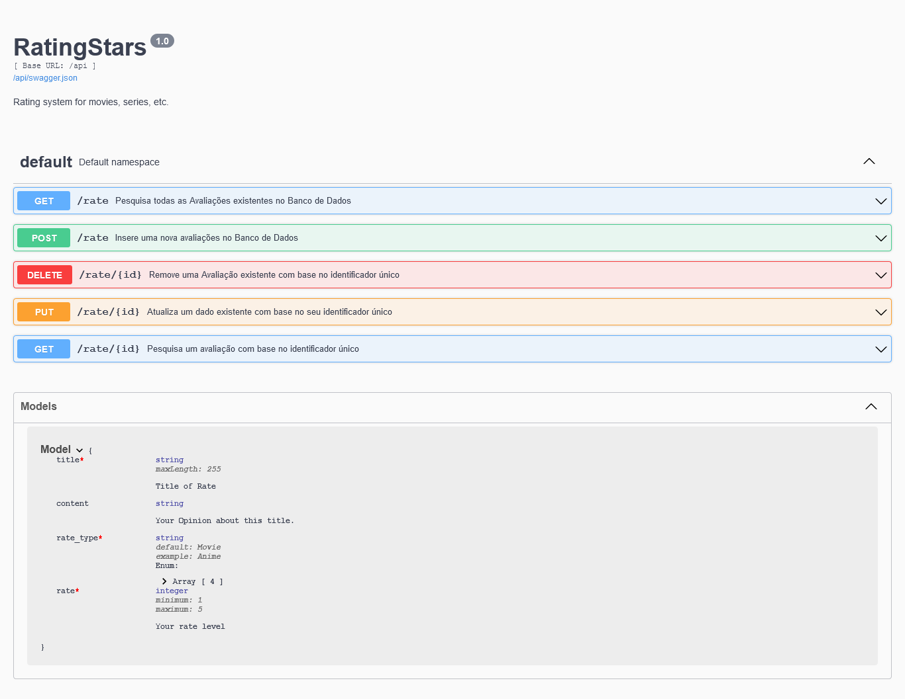
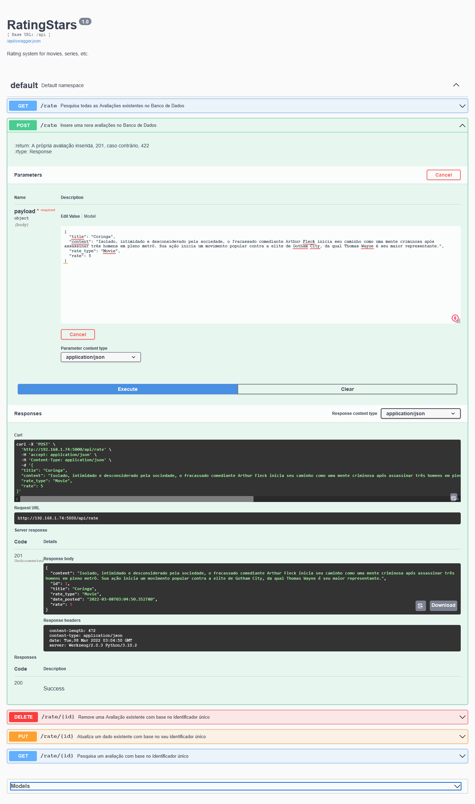

# Flask API REST 

Projeto de estudo sobre o Flask, flask-restx, SQLAlchemy, Swagger e Marshmallow para a construção de uma API RestFul. A API funciona como o projeto RatingStarts, permitindo a criação de avaliações.

**Em andamento**:
- Autenticação por Tokens
- O implementação do princípio "hateoas"


## Integração Contínua

O Workflow está ativado com a execução da verificação da organização com o `black`, `pydocstyle`, `isort`, e uma bateria de testes com o `pytest`, toda a vez que ocorrer um evento de `push` na branch `master`.


## 💻 Interface 

- Interface da Documentação disponível em `api/doc`



- Exemplo da operação de POST disponível em `api/rate`



- Exemplo da saída de dados usando GET disponível em `api/rate`

```json
[
    {
        "title": "Coringa",
        "content": "Isolado, intimidado e desconsiderado pela sociedade, o fracassado comediante Arthur Fleck inicia seu caminho como uma mente criminosa ap\u00f3s assassinar tr\u00eas homens em pleno metr\u00f4. Sua a\u00e7\u00e3o inicia um movimento popular contra a elite de Gotham City, da qual Thomas Wayne \u00e9 seu maior representante.",
        "rate_type": "Movie",
        "rate": 5,
        "uri": "http://192.168.1.74:5000/api/rate/1"
    },
    {
        "title": "Harry Potter e a Pedra Filosofal",
        "content": "Harry Potter \u00e9 um garoto \u00f3rf\u00e3o que vive infeliz com seus tios, os Dursleys. Ele recebe uma carta contendo um convite para ingressar em Hogwarts, uma famosa escola especializada em formar jovens bruxos. Inicialmente, Harry \u00e9 impedido de ler a carta por seu tio, mas logo recebe a visita de Hagrid,",
        "rate_type": "Movie",
        "rate": 4,
        "uri": "http://192.168.1.74:5000/api/rate/2"
    }

```


********************************************


## 🚀 Começando

Para obter uma cópia deste projeto:

```shell
git clone https://github.com/adrianomqsmts/flask-api-rest
cd flask-api-rest

python -m venv venv
# windows
.\venv\Scripts\activate
# linux
source  venv\bin\activate

pip install -r requirements.txt

cd project
python app.py
```

Para iniciar a API:

```shell
 python app.py
```

### 📋 Pré-requisitos

As bibliotecas usadas neste projeto podem ser encontradas no arquivo "requirements.txt"

```shell
pip install -r requirements.txt 
```

## 🛠️ Construído com

Ferramentas, linguagens e outras tecnologias usadas no desenvolvimento deste sistema.

* [Visual Studio Code](https://code.visualstudio.com/docs) - Ambiente de Desenvolvimento
* [Git e GitFlow](https://git-scm.com/) - Controle de Versões
* [Python](https://docs.python.org/3/) - Backend
* [flask](https://flask.palletsprojects.com/en/2.0.x/) - Framework backend
  * flask-sqlalchemy
  * flask-marshmallow
  * flask-restx
* [Pytest] - Como ferramenta de Testes
* [Integração Contínua](https://pt.wikipedia.org/wiki/CI/CD)
* [GitHub Actions](https://docs.github.com/en/actions)
* ...
... 

## ✒️ Autores

* **Desenvolvedor** - *Código e Documentação* - [Adriano](https://github.com/adrianomqsmts)

## 📄 Licença

...

